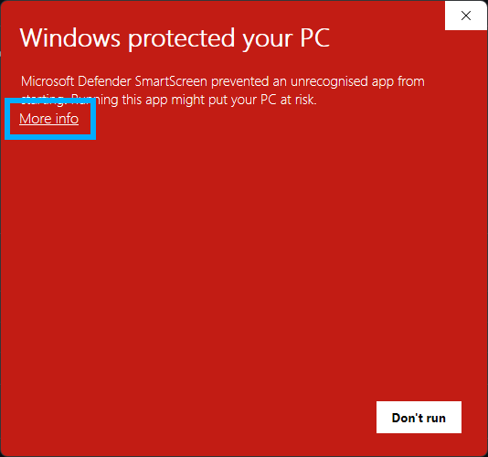
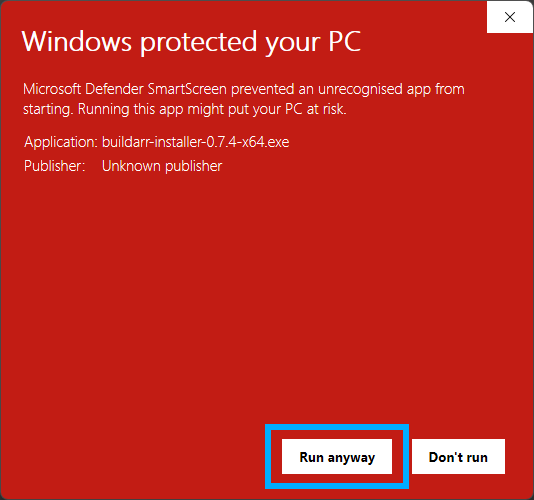
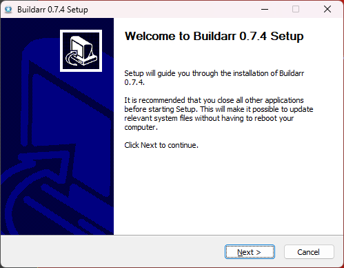
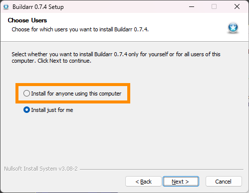
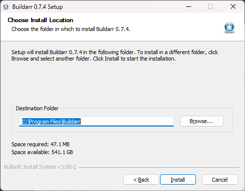
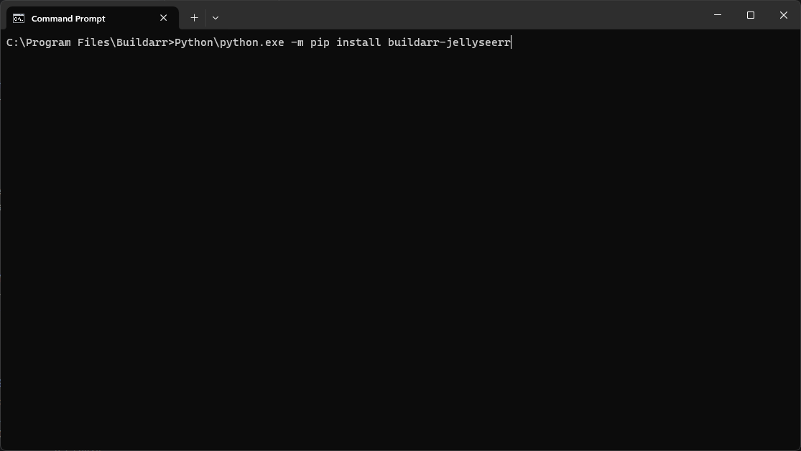
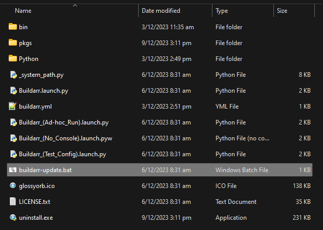
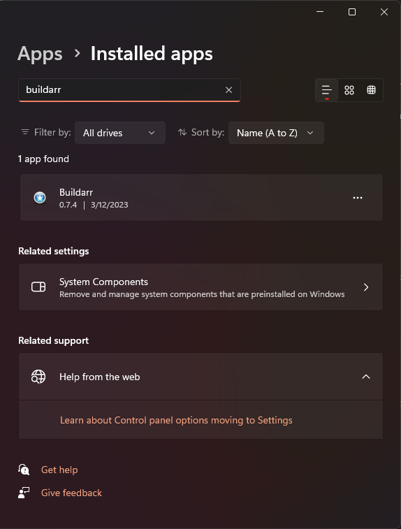

# Install Buildarr on Windows

Like many of the *Arr stack applications it was designed to manage, Buildarr is capable of running on Windows.

There are many ways of running Buildarr on Windows.

## As a Docker container

The [Docker container for Buildarr](docker.md) can be run on Windows using [Docker Desktop](https://www.docker.com/products/docker-desktop).

## Using the Buildarr Installer

A Buildarr Installer for Windows is now available, which bundles:

* Python
* The Buildarr application
* All currently available first-party plugins
* A basic script for updating Buildarr and plugins to the latest version

### Download

You can download the latest version of the Buildarr installer from the [Buildarr Installer releases page on GitHub](https://github.com/buildarr/buildarr-installer/releases).

### Installation

Run `buildarr-installer-<version>-<arch>.exe` to start the installation process.

You may get a prompt from Microsoft Defender SmartScreen when trying to run the installer, as shown below.
This is because the installer is not yet code signed, for a variety of reasons (primarily cost, and difficulty of getting keys for individuals).

To continue with the installation, click "More info" to reveal the information on the program to be run.

.

Check that the Buildarr installer is the program to be run, and click "Run anyway".



User Account Control will now prompt you to allow Buildarr Installer to make changes to your computer. Click "Yes" to continue to the installer.

Once the Buildarr Installer has opened, click "Next" and follow the on-screen instructions.



The installer provides an option to either install it just for the current user, or for anyone using the computer.
It is recommended to select "Install for anyone using this computer".



Buildarr can be installed to any location, if the user desires to change where it is installed from the default.

This documentation assumes Buildarr will be installed at `C:\Program Files\Buildarr`.



Continue following the on-screen instructions until installation is complete.

### Usage

!!! note

    You will need to create a `buildarr.yml` file to start using Buildarr.

    For more information on how to create `buildarr.yml`, refer to [Configuration](../configuration.md).

Buildarr will install the following shortcuts to the Windows start menu:

* `Buildarr` - Run Buildarr daemon in the foreground (with an open console window).
* `Buildarr (No Console)` - Run Buildarr daemon in the background (no console window).
* `Buildarr (Ad-hoc Run)` - Perform a single Buildarr run in the foreground (with an open console window), and exit.
* `Buildarr (Test Config)` - Test the Buildarr configuration file (`buildarr.yml`) for errors, and exit.

These Buildarr shortcuts read `buildarr.yml` from your home folder (e.g. `C:\Users\<username>\buildarr.yml`).

Buildarr is also available as a standard CLI command from Command Prompt, or Windows Terminal.
To check that it works, open your terminal and run the following command:

```bat
buildarr --help
```

For more information on the available Buildarr CLI commands, refer to [Usage](#usage).

### Plugins

Buildarr Installer bundles all currently available first-party Buildarr plugins, so there is usually no need to install plugins separately.

However, if you would like to install a Buildarr plugin that is not bundled, this can be done using the following procedure.

First, open a command prompt/terminal session at the Buildarr installation folder (e.g. `C:\Program Files\Buildarr`), **as an administrator**.



Then run the following command to install the package:

```bat
Python\python.exe -m pip install <plugin package name>
```

Once this is done, restart Buildarr if it is already running. The plugin should automatically be loaded on startup, and it will be usable in `buildarr.yml`.

### Updating

The recommended method for updating Buildarr is to download the installer for the latest version, and install it on top of the existing Buildarr installation.

However, if you wish to only update the Python packages that constitute Buildarr, the installation bundles a rudimentary update script called `buildarr-update.bat`, found in the Buildarr installation folder (e.g. `C:\Program Files\Buildarr\buildarr-update.bat`).



Simply run `buildarr-update.bat` **as an administrator** to update Buildarr Core, and the installed plugins to the latest version.

You may need to open an administrator command prompt/terminal at this location to run the script properly.

### Uninstallation

Buildarr will be listed in "Add or Remove Programs" as a standard application, and can be uninstalled there like any other application.



## As a Windows service

Buildarr currently does not natively support running as a Windows service.

However, [NSSM (the Non-Sucking Service Manager)](https://nssm.cc) can be used to register Buildarr as a Windows service.

### Installation

[Download NSSM](https://nssm.cc/download) and save the EXE to a path that is accessible using the command prompt (the `PATH` environment variable).

Install Buildarr using the [Buildarr Installer for Windows](#installer), and then run the following commands
(substituting `C:\path\to` and `C:\path\to\buildarr.yml` for the location of your [Buildarr configuration file](../configuration.md)).

```bat
nssm install Buildarr
nssm set Buildarr Application "C:\Program Files\Buildarr\bin\buildarr.exe"
nssm set Buildarr AppParameters "daemon" "C:\path\to\buildarr.yml"
nssm set Buildarr AppDirectory "C:\path\to"
nssm set Buildarr AppStdout "C:\path\to\buildarr.log"
nssm set Buildarr AppStderr "C:\path\to\buildarr.log"
nssm set Buildarr DisplayName Buildarr
nssm set Buildarr Description Buildarr Arr Stack Manager
nssm set Buildarr AppStopMethodSkip 0
nssm set Buildarr AppStopMethodConsole 3000
nssm set Buildarr AppStopMethodWindow 3000
nssm set Buildarr AppStopMethodThreads 3000
nssm set Buildarr AppThrottle 5000
nssm set Buildarr AppExit Default Restart
nssm set Buildarr AppRestartDelay 0
```

If Sonarr and other applications Buildarr will manage are also registered as Windows services, run the following command (for each service) to set Buildarr as dependencies of those services:

```bat
nssm set Buildarr DependOnSvc <Service-Name>
```

If all of these commands have successfully run, you can either start Buildarr from the Windows service manager, or run the following command to start it using `nssm`:

```bat
nssm start Buildarr
```

### Uninstallation

Stop the Buildarr service, then run the following command to remove it as a service.

```bat
nssm remove Buildarr
```

After that, simply follow the [uninstallation instructions for Buildarr Installer](#uninstallation).

## As a Python application

If you have [Python for Windows](https://www.python.org/downloads/windows) already installed, then you can [install Buildarr and its plugins as Python packages](python.md).

Both the `pipx` method and the virtual environment method will work. The `pipx` method is recommended for ease of use, as it provides a way to more easily install `buildarr` as a global command to your shell environment.
